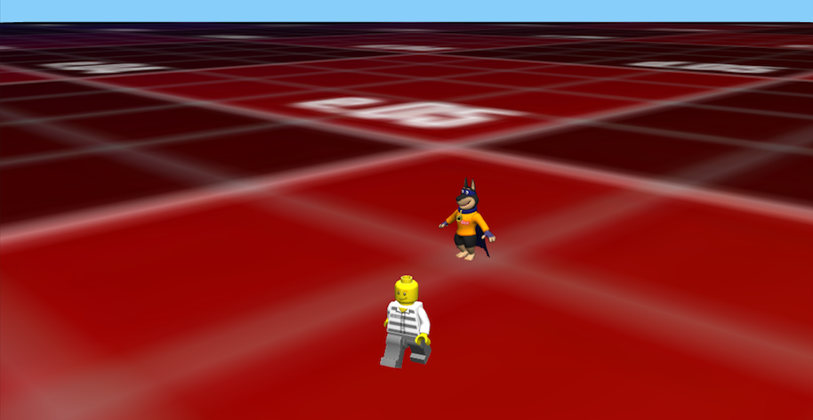

#### [Demo](https://zhengxiangyue.github.io/animation/) 

### Build

```bash
$ git clone https://github.com/Zhengxiangyue/animation.git
$ cd animation/runtime
$ cmake ..
```

```bash
$ make
```

```bash
$ ./playground
```

## On branch 1.0.0 - textured animation

#### Up

Lego move forward(culmysily)

#### Left/Right

Lego rotate(culmysily)

#### Space

Lego jump(culmysily)



