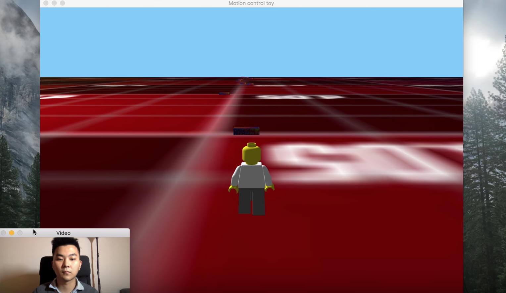

### Build

```bash
$ git clone https://github.com/Zhengxiangyue/animation.git
$ git checkout 1.0.1
$ cd animation/runtime
$ cmake ..
```

```bash
$ make
```

```bash
$ python ./motion_detection.py
$ ./playground
```

## On branch 1.0.1 - Facial motion control

#### Turning head left

Lego move left

#### Turning head right

Lego move right

#### Turning head up

Lego jump

[Demo](https://zhengxiangyue.github.io/animation/motion/) 



