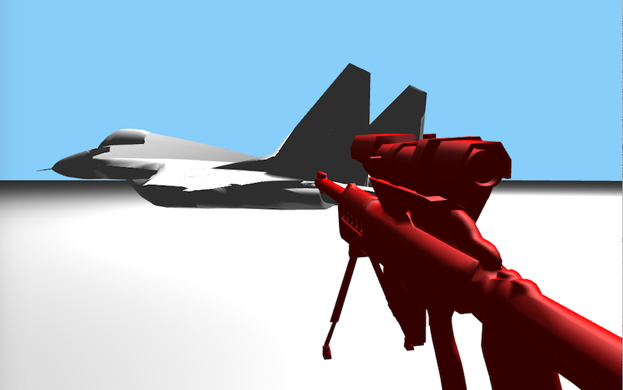

### Build

```bash
$ git clone https://github.com/Zhengxiangyue/animation.git
$ cd animation/runtime
$ cmake ..
```

```bash
$ make
```

```bash
$ ./playground
```

## On branch master - key framing interpolation

#### W, A, S, D and mouse

Controll the camera position

#### N

Change mode, when red object occurs, you are in "Edit mode", otherwise you are in "View mode"

#### M

 Change the modifying rigid object, the modifying object is shown in red

#### P

Set the current location a key point, a small square will appear

#### UP

Move the object forward

#### DOWN

Move the object backward

#### (Shift + ) X, Y, Z 

Rotate the object 

### Ohter

Euler angles, quaternian, Catmul-Rom or B-splines is changed in code

[Demo](https://zhengxiangyue.github.io/animation/) 



